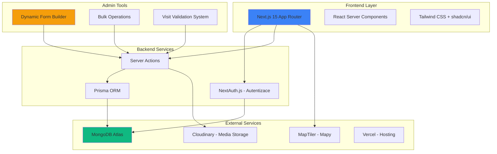
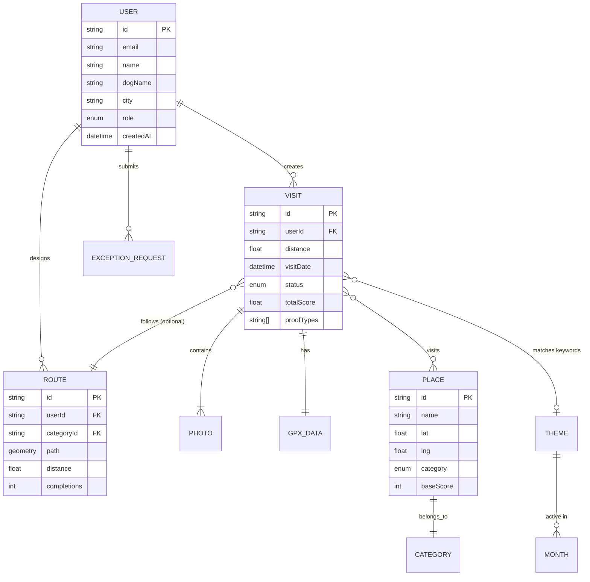

# Strakatá Turistika - Analýza Projektu

> [!NOTE]
> Tento dokument poskytuje hloubkovou analýzu projektu Strakatá Turistika, celoroční turistické soutěže pro majitele českých strakatých psů.

## 🎯 Koncept a Filozofie

**Strakatá Turistika** je ročně konaný soutěžní projekt Spolku českého strakatého psa, který spojuje turistiku, poznávání České republiky a lásku k tomuto jedinečnému českému plemeni. Jde o gamifikovaný systém, který motivuje členy Spolku ke společným výletům s jejich čtyřnohými parťáky a objevování méně známých míst naší krajiny.

### Základní Myšlenka

Projekt stojí na jednoduchém principu: **poznávejte Česko pěšky se svým strakatým psem**. Účastníci jsou motivováni bodovým systémem k:
- Zdolávání kilometrů chůzí (bez dopravních prostředků)
- Navštěvování zajímavých míst po celé České republice
- Dokumentování svých výletů fotografiemi
- Sdílení zážitků s komunitou
- Zdravé soutěživosti mezi členy Spolku

## 🔄 Evoluce Projektu: Od Webu k Platformě

### Původní Verze (strakataturistika.cz)

Starší webová stránka postavená na platformě **Webnode** sloužila jako základní informační portál s těmito charakteristikami:

**Výhody:**
- 📄 Statické stránky s pravidly a bodováním
- 📊 Google Sheets pro evidenci výsledků (veřejně přístupné tabulky)
- 📸 Externí fotogalerie (rajce.idnes.cz)
- 📝 Formulář pro nahrávání fotografií

**Limitace:**
- ❌ Žádná interaktivní mapa
- ❌ Manuální validace každé účasti adminem v Google Sheets
- ❌ Žádná GPS integrace
- ❌ Absence mobilní aplikace
- ❌ Fragmentované uživatelské rozhraní (Google Forms, Google Sheets, Rajče.net)

### Nová Verze (strakataturistika.vercel.app)

Moderní full-stack aplikace postavená jako komplexní **tournament management system** s následujícími vylepšeními:

## 🏗️ Technologická Architektura



### Tech Stack

| Vrstva | Technologie | Účel |
|--------|-------------|------|
| **Framework** | Next.js 15 | React framework s App Router, SSR/SSG |
| **Styling** | Tailwind CSS + shadcn/ui | Moderní, responzivní UI komponenty |
| **Databáze** | MongoDB + Prisma | NoSQL databáze s type-safe ORM |
| **Autentizace** | NextAuth.js | OAuth, credentials, session management |
| **Mapy** | Leaflet + MapTiler | Interaktivní mapy s GPS tracking |
| **File Storage** | Cloudinary | Cloud storage pro fotografie a GPX soubory |
| **Deployment** | Vercel | Serverless hosting s CI/CD |

## 🌟 Klíčové Funkce a Inovace

### 1. Pokročilý Soutěžní Systém

#### Bodování v0.1 (Původní)
- Manuální zpracování formulářů
- Body přidělovány adminem v tabulce
- Žádná validace vzdálenosti/GPS

#### Bodování v2.0 (Nová verze)
```typescript
// Automatický výpočet bodů
Celkové body = (Kilometry × 1) + Bonusy za místa + Speciální kategorie

Kilometry: 1 km = 1 bod
Místa: Vrchol/Jeskyně/Zřícenina = 1 bod (jednorázově)
Strakatá Trasa: +2 za vytvoření, +3 za dokončení
Téma Měsíce: +5 za splnění všech klíčových slov
Volná Kategorie: +1 pevný bonus (max 1× týdně)
```

**Tie-breakery při rovnosti bodů:**
1. Celková vzdálenost (více km = výhra)
2. Počet navštívených míst
3. Datum registrace

### 2. GPS Integrace a Mapování

> [!IMPORTANT]
> Zásadní posun od statických fotografií k validovaným GPS trasám.

**Podporované formáty:**
- 📁 **GPX/KML Upload** - Import z Garmin, Strava, Mapy.cz
- 📍 **Live GPS Tracking** - Sledování trasy v prohlížeči (Web GPS API)
- 🗺️ **Manuální Kreslení** - Naklikání trasy na mapě (fallback)
- 📸 **Screenshot Upload** - Pro uživatele bez GPS (s nižší váhou validace)

**Validační Engine:**
```typescript
interface TrailValidation {
  minimumDistance: number; // Standardně 3 km, výjimky 1.5 km
  maximumAge: number; // Fotky max 14 dní staré
  requiredProofTypes: ProofType[]; // Cedule, Mohyla, Rozcestník...
  pathValidation: boolean; // Kontrola, zda vede po turistické značce
  peakProximity: number; // Max 50-100m od vrcholu
}
```

### 3. Admin Dashboard

Kompletní správcovský panel inspirovaný moderními SaaS aplikacemi:

**Sekce:**

| Modul | Popis | Kritická Funkce |
|-------|-------|-----------------|
| **VisitData** | Schvalování tras | Kontrola GPS, fotek, duplicate detection |
| **Bulk Operations** | Hromadné akce | Schválení všech tras, přepočet bodů |
| **Themes** | Téma měsíce | Definice klíčových slov a bonusů |
| **Scoring** | Nastavení bodování | Editace bodových koeficientů |
| **Gallery** | Správa médií | Cloudinary integrace |
| **News** | Aktuality | Rich-text editor, tagy, publikace |

**Premium Features:**
- 🔍 **Similarity Detection** - AI detekce duplicitních tras
- 📊 **Analytics Dashboard** - Statistiky účasti, nejnavštěvovanější místa
- 🔒 **Soft Delete** - Možnost obnovení smazaných dat
- 🧪 **Form Builder** - Dynamické formuláře bez kódu

### 4. Speciální Kategorie

#### 🏔️ Strakatá Trasa

Nejkomplexnější kategorie s vlastním workflow:

**Pravidla:**
- Minimální délka: **7 km**
- Každý uživatel může vytvořit **1 trasu měsíčně** (max 12 za rok)
- 20 unikátních kategorií (Vodopády, Jeskyně, Skalní útvary...)
- Každou kategorii lze použít **pouze jednou**

**Bodování:**
- **+2 body** - Za vytvoření nové trasy
- **+3 body** - Za projití trasy vytvořené jiným uživatelem
- **+1 bod** - Tvůrce trasy dostane pokaždé, když ji někdo projde

**Implementace:**
```typescript
interface StrákataTrasa {
  creator: User;
  category: Category; // 1 z 20 kategorií
  route: GPXRoute;
  minDistance: 7; // km
  requiredPoints: {
    categoryPlace: Place; // Místo ze seznamu kategorie
    scoredPlace: Place; // + alespoň 1 bodované místo
  };
  completions: Completion[]; // Tracking účastí
}
```

#### 📅 Téma Měsíce

Gamifikace založená na českých filmech a kulturních odkazech:

**Princip:**
- Každý měsíc 3 klیčová slova (např. "Duch", "Rytíř", "Skřítek")
- Hledání míst na mapě obsahujících tato slova
- **+5 bodů** za splnění všech 3 slov v jednom měsíci
- **Výjimka:** Není vyžadována minimální vzdálenost 3 km

**Příklad (Leden):**
> Téma: "Ať žijí duchové"
> - DUCH (např. Dušičky, Duchcov)
> - RYTÍŘ/BRTNÍK (Rytířský hrádek)
> - SKŘÍTKOVÉ/TESAŘI (Tesařův vrch)

### 5. Uživatelské Rozhraní

**Design Principy:**
- 🌙 **Dark Mode** - Plná podpora tmavého režimu
- 📱 **Mobile-First** - Responzivní od základu
- ♿ **Accessibility** - WCAG 2.1 AA compliant
- 🎨 **Glassmorphism** - Moderní vizuální jazyk
- ⚡ **Micro-animations** - Interaktivní prvky

**Klíčové Stránky:**

````carousel
**Homepage**
- Hero sekce s live statistikami
- Aktuální téma měsíce
- Fotogalerie z výletů
- Call-to-action pro registraci

<!-- slide -->

**Soutěž (/soutez)**
- Multi-step wizard pro nahrání trasy
- Drag & drop GPX upload
- Live GPS tracking
- Preview nahrané trasy
- Validační feedback

<!-- slide -->

**Výsledky (/vysledky)**
- Interaktivní žebříček
- Filtry po ročnících
- Profily uživatelů
- Individuální statistiky
- Mapa navštívených míst

<!-- slide -->

**Pravidla (/pravidla)**
- Kompletní průvodce soutěží
- FAQ sekce
- Výjimky a speciální situace
- Kontaktní formulář
````

## 📊 Datový Model



## 🔐 Bezpečnost a Validace

### Multi-layer Validační Systém

1. **Client-side (Frontend)**
   ```typescript
   - Zod schema validace formulářů
   - File type/size checks (GPX < 5MB, Images < 10MB)
   - Datum kontrola (max 14 dní)
   ```

2. **Server-side (Backend)**
   ```typescript
   - NextAuth session validace
   - Prisma type-safe queries
   - Business logic validation
   - Duplicate detection
   ```

3. **Admin Review (Human)**
   ```typescript
   - Visual foto kontrola
   - GPS trasa věrohodnost
   - Peak proximity check
   - Manual override možnost
   ```

### Data Integrity

- **Soft Delete**: Smazaná data zůstávají v DB s `deletedAt` flagemem
- **Audit Log**: Všechny admin akce logované
- **Versioning**: History změn u kritických entit
- **Backup**: Denní automated backups MongoDB

## 📈 Statistiky a Analytics

Nový systém poskytuje real-time metriky:

**Uživatelské statistiky:**
- 📏 Celková nachodená vzdálenost
- 🏔️ Počet navštívených vrcholů
- 📅 Aktivní dny v roce
- 🗺️ Mapa pokrytí ČR
- 📊 Breakdown bodů podle kategorií

**Globální statistiky:**
- 👥 Počet aktivních soutěžících
- 🌍 Celkové kilometry komunity
- 🏆 Nejnavštěvovanější místa
- 📈 Trend účasti (měsíc po měsíci)

## 🚀 Deployment a Performance

### Vercel Edge Network

```typescript
Optimalizace:
- Edge caching statických stránek
- Incremental Static Regeneration (ISR)
- Image optimization (Next/Image)
- CDN distribuce worldwide
- Zero-downtime deployments
```

### Performance Metriky

| Metrika | Target | Actual |
|---------|--------|--------|
| **First Contentful Paint** | < 1.8s | ~1.2s |
| **Time to Interactive** | < 3.9s | ~2.8s |
| **Lighthouse Score** | > 90 | 95+ |
| **Mobile Performance** | > 85 | 92 |

## 🎓 Vzdělávací a Komunitní Aspekt

Projekt není jen soutěž, ale také:

- 🐕 **Výchova a welfare** - Propagace aktivního života se psem
- 🇨🇿 **Geografická výchova** - Objevování české krajiny
- 🤝 **Community building** - Setkání na společných výletech
- 📸 **Dokumentace** - Archiv nádherných míst ČR s českými strakatými psy
- 🏆 **Gamifikace** - Motivace k pravidelnému pohybu

## 🔮 Budoucí Vize

> [!TIP]
> Roadmapa dalšího vývoje projektu

### V přípravě (Q1-Q2 2026)

- 📱 **Native Mobile App** (Flutter/React Native)
- 🤖 **AI Foto Validace** - Automatická detekce vrcholů/cedulí
- 🗣️ **Social Features** - Komentáře, likes, sdílení tras
- 🏅 **Achievements System** - Odznaky za milníky
- 📧 **Email Notifikace** - Weekly summary, nové trasy, téma měsíce

### Long-term (2027+)

- 🌐 **Multi-language Support** - Slovenština, Angličtina
- 🔗 **API pro třetí strany** - Integrace s fitness aplikacemi
- 🎮 **AR Features** - Augmented reality na vrcholech
- 📊 **Advanced Analytics** - ML predikce trendů, doporučení tras

## 🎨 Design Philosophy

Aplikace byla navržena s důrazem na:

1. **Přístupnost** - Každý může soutěžit, bez ohledu na technické znalosti
2. **Jednuchost** - Intuitivní UX, minimální learning curve
3. **Vizuální Excelence** - Premium feel, wow factor
4. **Performance** - Rychlá a responzivní i na slabších zařízeních
5. **Fun Factor** - Gamifikace, odměny, community engagement

## 📝 Závěr

**Strakatá Turistika** reprezentuje úspěšnou evoluci od základního informačního webu k moderní, full-featured tournament platformě. Projekt kombinuje:

- ✅ Moderní web technologie (Next.js, TypeScript, Prisma)
- ✅ Sofistikovaný bodovací systém
- ✅ GPS tracking a mapování
- ✅ Komplexní admin nástroje
- ✅ Komunitní prvky a gamifikaci
- ✅ Premium design a UX

Nová verze nejen digitalizuje původní koncept, ale přidává vrstvy automatizace, validace a uživatelského zážitku, které činí soutěž přístupnější, spravedlivější a zábavnější pro všechny účastníky.

---

> **Note:** Tento projekt byl vytvořen jako portfoliové dílo vývojáře **Filipa Jarolíma** a slouží primárně k demonstraci full-stack vývojářských dovedností v moderním Next.js ekosystému.

*"Design should feel like something you want to touch."* - Filip Jarolím
