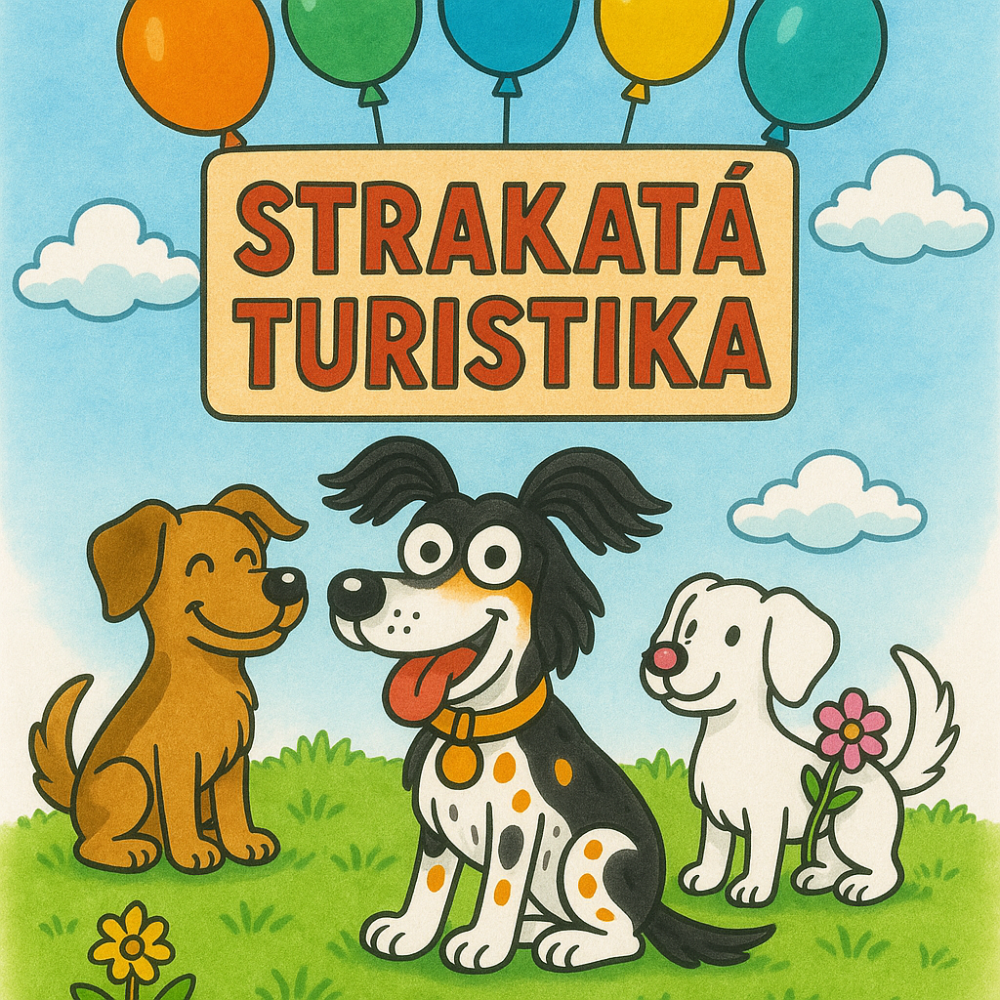

  

<h1 align="center">Strakatá Turistika</h1>

  A playful web showcase inspired by the Czech Spotted Dog. 
  Built as a portfolio project by <strong>Filip Jarolím</strong>.

  <a href="https://strakataturistika.vercel.app" target="_blank" style="display:inline-block;padding:10px 18px;border-radius:12px;border:1px solid #ccc;text-decoration:none;font-weight:500;">
    🌐 Visit Live Site
  </a>

---

<h2>🧭 What Is This?</h2>

  <strong>Strakatá Turistika</strong> is a personal project that explores how beautiful design and playful themes can enhance the experience of web mapping. It’s not a product or tool — it’s a <em>visual and technical showcase</em> created for fun and experimentation.

<h2>🛠️ Tech Stack</h2>

<ul>
  <li>⚛️ <strong>Next.js</strong> – App Router with TypeScript</li>
  <li>🎨 <strong>Tailwind CSS</strong> – for clean, scalable design</li>
  <li>🧩 <strong>shadcn/ui</strong> – component primitives</li>
  <li>🗺️ <strong>Leaflet + MapTiler</strong> – dynamic maps and tiles</li>
  <li>🧬 <strong>Prisma + MongoDB</strong> – data modeling and storage</li>
  <li>☁️ <strong>Vercel</strong> – fast hosting and deployment</li>
</ul>

<h2>✨ Features</h2>

<ul>
  <li>🐶 Custom dog-themed icons & UI</li>
  <li>🗺️ Interactive map with drawn routes</li>
  <li>📱 Mobile-first and responsive</li>
  <li>🎨 Polished layout, clean component structure</li>
  <li>🚀 Fully static</li>
</ul>

<h2>📸 Preview</h2>

<em>Minimal interface, focused on the experience</em>

<h2>⚠️ Notes</h2>

  This project is <strong>not intended for reuse or installation</strong>. It is part of my personal portfolio and exists to demonstrate frontend skills, visual consistency, and theme-driven design.

<h2>👨‍💻 Author</h2>

  Created by <strong>Filip Jarolím</strong> 
  Frontend developer & visual creative

<em>“Design should feel like something you want to touch.”</em>

